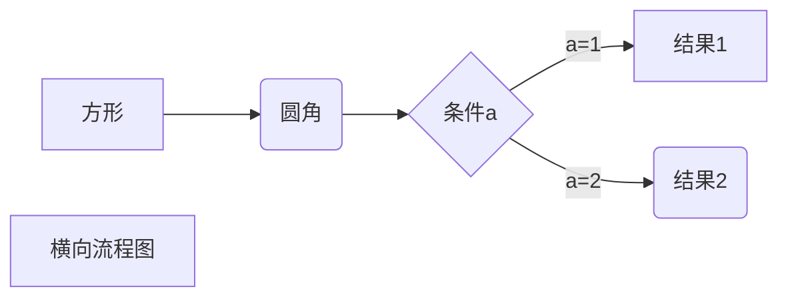
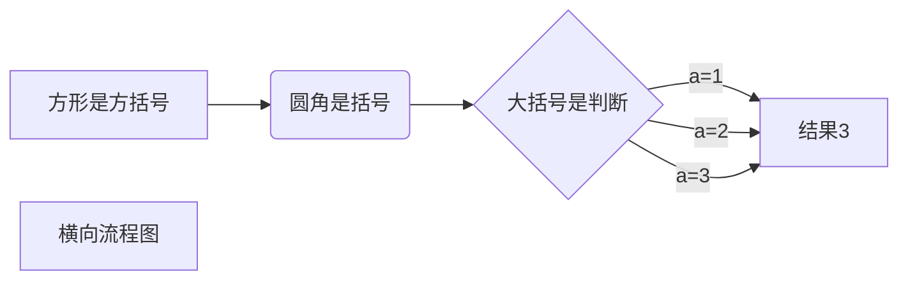
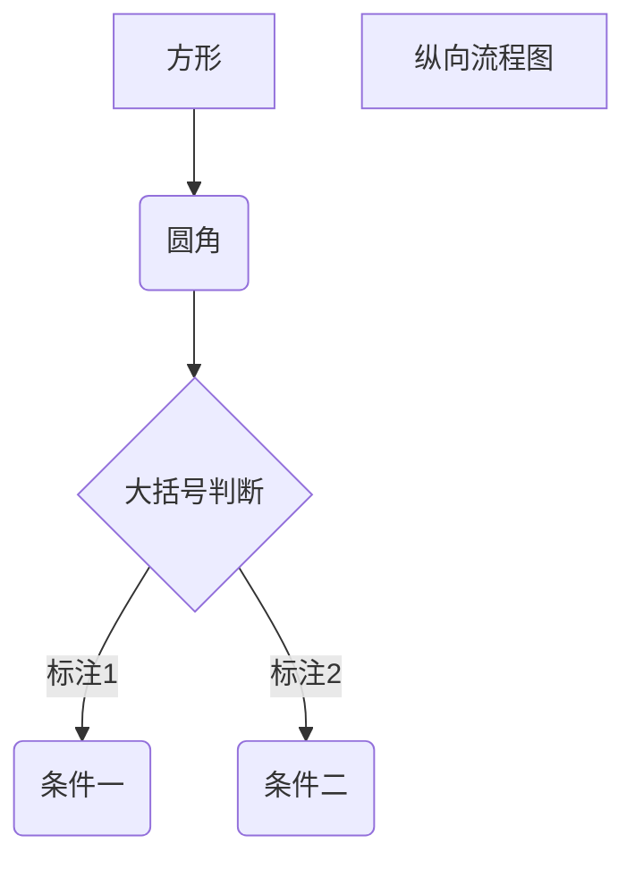

## 一、标题

>在想要设置为标题的文字前加#来表示,#个数表示几级标题
>
>**效果如下**
>
># 一级标题
>## 二级标题
>### 三级标题
>#### 四级标题
>##### 五级标题
>###### 六级标题

## 二、字体

>**倾斜**
>要倾斜的文字左右分别用一个*包起来
>**加粗**
>要加粗的文字左右分别用两个\*\*包起来
>**加粗倾斜**
>要加粗的文字左右分别用三个\*\*\*包起来
>**下标**
>属于下标的文字左右分别用一个\~包起来
>**加删除线**
>要加删除线的文字左右分别用两个\~\~包起来
>**下划线**`可能有些不支持`
>要加下划线的使用u标签<u>带下划线的文本</u>
>
>**脚注**
>
>创建的脚注在这里引用[^脚注名称]
>
>[^脚注名称]: aaaaa

**示例**
*这是倾斜文字* `|` **这是加粗文字** `|` ***这是倾斜加粗文字*** `|` x~2~ `|` ~~这是加删除线的文字~~ 

## 三、引用块

>在引用的文字前加`>`即可，引用也可以嵌套，如加两个>>三个>>>n个..
>
>**示例:**
```
>这是引用的内容
>>这是引用的内容
>>>>这是引用的内容
```
**效果如下:**
>这是引用的内容
>>这是引用的内容
>>
>>>>这是引用的内容

## 四、分割线

三个或三个以上的`-`或者`*`都可以
**示例:**

~~~
a
---
a
----
a
***
a
****
~~~
**效果如下**
a
___
a
___
a
***
a
****

## 五、图片

**语法**

> \!\[alt 属性文本\]\(图片地址\)
>
> + 开头一个感叹号
> + 接着一个方括号,里面放上图片的替代文字
> + 接着一个普通括号,


## 六、超链接

## 七、列表

### 无序列表

>语法：无序列表用`-` `+` `*`任何一种都可以，符合后面必须跟着空格
>如果存在子列，则在符号前加tab建或三个空格

**示例:**

```
- 列表内容
+ 列表内容
* 列表内容
```
**效果:**

- 列表内容
    - 列表内容
* 列表内容
  * 泪飙
+ 列表内容
  + 列表内容
###有序列表
>语法：数字加点后面加空格

**示例:**

~~~
1. 有序列表内容
   1. 有序列表子列
2. 有序列表内容
3. 有序列表内容
~~~
**效果如下:**

1. 有序列表内容
   1. 有序列表子列
2. 有序列表内容
3. 有序列表内容


## 八、表格

**语法:**

>--:设置标题内容居右对齐
>
>:--:居中对齐
>
>:-- 居左

**示例:**

>\| 表头| 表头| 表头 |
>\| :---- | :--: | :--: |
>\| 开发一 |  12  | VIP  |
>\| 开发二 |  23  | 普通 |


| 姓名   | 年龄 | 身份 |
| :----- | :--: | :--: |
| 开发一 |  12  | VIP  |
| 开发二 |  23  | 普通 |

## 九、代码

**语法**

> 单行代码用(单个单引号)`包起来
> 多行代码用(三个单引号)```包起来

**示例:**

~~~
这是代码块
2. 还是可以的
function a() {
  console.log('Hello, MarkDown')
}
~~~
## 十、流程图


### 1、横向流程图







### 2、纵向流程图



### 3、标准流程图


>**源码**
>
>\`\`\`flow
>st=>start: 开始框
>op=>operation: 处理框
>cond=>condition: 判断框(是或否?)
>sub1=>subroutine: 子流程
>io=>inputoutput: 输入输出框
>e=>end: 结束框
>st->op->cond
>cond(yes)->io->e
>cond(no)->sub1(right)->op
>\`\`\`


```flow
st=>start: 开始框
op=>operation: 处理框
cond=>condition: 判断框(是或否?)
sub1=>subroutine: 子流程
io=>inputoutput: 输入输出框
e=>end: 结束框
st->op->cond
cond(yes)->io->e
cond(no)->sub1(right)->op
```


### 4、标准流程图(纵向)

>**源码**
>
>\`\`\`flow
>st=>start: 开始框
>op=>operation: 处理框
>cond=>condition: 判断框(是或否?)
>sub1=>subroutine: 子流程
>io=>inputoutput: 输入输出框
>e=>end: 结束框
>st(right)->op(right)->cond
>cond(yes)->io(bottom)->e
>cond(no)->sub1(right)->op
>\`\`\`


### 5、UML时序图

>**源码**
>\`\`\`sequence
>对象A->对象B: 对象B你好吗?（请求）
>Note right of 对象B: 对象B的描述
>Note left of 对象A: 对象A的描述(提示)
>对象B-->对象A: 我很好(响应)
>对象A->对象B: 你真的好吗？
>\`\`\`


### 6、UML时序图(复杂)

>**源码**
>\`\`\`sequence
>Title: 标题：复杂使用
>对象A->对象B: 对象B你好吗?（请求）
>Note right of 对象B: 对象B的描述
>Note left of 对象A: 对象A的描述(提示)
>对象B-->对象A: 我很好(响应)
>对象B->小三: 你好吗
>小三-->>对象A: 对象B找我了
>对象A->对象B: 你真的好吗？
>Note over 小三,对象B: 我们是朋友
>participant C
>Note right of C: 没人陪我玩
>\`\`\`


### 7、UML时序图(标准)
>**源码**
>\`\`\`mermaid
>%% 时序图例子,-> 直线，-->虚线，->>实线箭头
>  sequenceDiagram
>    participant 张三
>    participant 李四
>    张三->王五: 王五你好吗？
>    loop 健康检查
>        王五->王五: 与疾病战斗
>    end
>    Note right of 王五: 合理 食物 <br/>看医生...
>    李四-->>张三: 很好!
>    王五->李四: 你怎么样?
>    李四-->王五: 很好!
>\`\`\`


### 8、甘特图

>**源码**
>\`\`\`mermaid
>%% 语法示例
>        gantt
>        dateFormat  YYYY-MM-DD
>        title 软件开发甘特图
>        section 设计
>        需求                      :done,    des1, 2014-01-06,2014-01-08
>        原型                      :active,  des2, 2014-01-09, 3d
>        UI设计                     :         des3, after des2, 5d
>    未来任务                     :         des4, after des3, 5d
>        section 开发
>        学习准备理解需求                      :crit, done, 2014-01-06,24h
>        设计框架                             :crit, done, after des2, 2d
>        开发                                 :crit, active, 3d
>        未来任务                              :crit, 5d
>        耍                                   :2d
>        section 测试
>        功能测试                              :active, a1, after des3, 3d
>        压力测试                               :after a1  , 20h
>        测试报告                               : 48h
>\`\`\`


## 十一、高级技巧

>**支持html标签**
>
>>常用的标签
>>
>>+ **\<kbd\>** 效果: <kbd>标签块</kbd>
>>+ **\<b\>** 效果: <b>aa</b>
>>+ **\<i\>** 效果: <i>aa</i>
>>+ **\<em\>** 效果: <em>aa</em>
>>+ **\<sub\>** 效果:  a<sub>2</sub>
>>+ **\<sup>** 效果: a<sup>2</sup>
>>+ **\<br\>** 效果: 换行
>>
>>不在Markdown涵盖范围内的标签都可以直接在文档里面添加html标签
>>
>><kbd>标签</kbd>
>
>
>>**转义**
>>
>>加粗：**啊啊**   不转义: \*\*啊啊\*\*
>
>
>>**公式**: 使用\$\$包裹公式
>>$$
>>V1 * V2
>>$$
>>
>>
>>


